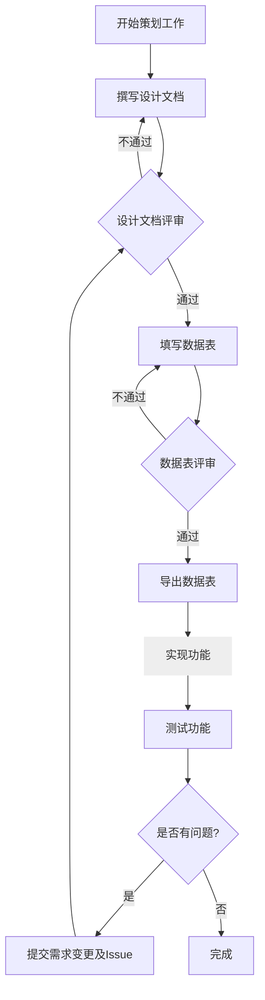

# 策划工作流

策划的使命是**消化复杂性，而非传递复杂性**。“结构化文档”和“程序思维”的本质，是在策划端将天马行空的创意、模糊的需求，消化、重构为清晰、模块化、接口明确的工程问题。

## **文档先行 (Document First)**

坚持文档先行的工作思想。任何灵感和建议如果不落实到文档中，就是空谈。

1.  **先写后说**：异步文档是一种远比即时通讯更高效的沟通方式。在任何正式讨论、会议或向他人征求意见**之前**，必须先将核心思路、方案、问题点整理成结构清晰的Markdown草稿。这样的习惯可以帮助你完成逻辑闭环，亦可帮助受众理解和消化信息，并给出思考过的纸面反馈——避免“空对空”的讨论。
2.  **单一事实来源**：确保关于该功能/系统的最权威、最完整的信息都记录在这份文档中。其他内容请附带引用源。
3.  **决策留痕**：所有重要的讨论结论、修改意见和最终决策，都应明确记录，包括结论、责任人和时间。这是项目最重要的资产之一。因此仍然推荐使用Git作为版本控制——Blame也是重要的一环。
4.  **明确受众**：是想解决问题、提出更多问题还是单纯提供思路？在文档创建初期，就应明确核心读者（如投资者、制作人、技术负责人、美术负责人）和协作者。文档的本质是思维的压力测试和协作契约。落笔成文是强迫自己逻辑自洽的过程；共享文档是建立共同认知和承诺的过程。

## **程序思维**

熟练掌握一门编程语言是策划人员的基本素质，能够帮助你更好地理解游戏逻辑和数据处理；尤其在功能设计方面，能够以程序设计的思维来思考问题，并省去大量的冗余设计和无效沟通。

举例说明。设计一个战斗流程功能时，未掌握编程语言的策划人员可能会设计出一个复杂却又不完善的流程图，用大量的精力描述一个自以为困难且复杂实则引擎或语言特性早已提供的方法、或是用大量的逻辑判断流程图来描述一个应该使用另一种更简洁合理的拓扑关系。

**策划无需成为程序员，但必须掌握游戏工程化设计的要素 ​**​：

1. **数据结构敏感度** ​​ 理解程序是数据驱动的，数据结构是程序的核心。设计时应当优先考虑数据结构的合理性和可扩展性。优先设计数据结构而非流程图，理解数据-逻辑和视图的关联与分离。
2. **封装抽象意识** ​​ 识别重复模式转化为函数或类，避免重复造轮子。
3. **设计模式理解** 理解常用设计模式，如决策模式、观察者模式、状态模式等，并能在设计中合理应用。
4. **边界思维** ​​ 预设输入校验和异常处理，避免逻辑漏洞。
5. **模块分割** 将复杂逻辑拆分为小模块，并逐个实现和测试。了解已经存在的模块和已经开放的 API，避免重复造轮子或制作当前设计工作范围之外的功能。如果需要额外的 API，请先与程序沟通，确认是否可以实现，切勿过度设计。

如果你是策划人员中的**系统/数值策划**，应当尽量通过自动化工具减少自己的重复劳动以及测试成本。通过Python开发符合自己习惯的工具、向工具程序员请求支持，或是使用现有的自动化工具来提高效率。
上述提及的能力被视为基础能力，工作考核和时间规划中会将**本应的**自动化时间纳入考量。

## **Excel**

使用 Excel 设计数据时，应当注意以下原则：

- **数据规范化**：避免多余空格、空白行或空白列。
- **表头标准化**：采用唯一列名，使用大驼峰命名法。尽量不要使用中文。
- **数据类型规范化**：避免混合数据类型，保证与设计原意一致。
- **禁止合并单元格**：合并单元格会影响数据分析和处理。
- **工作表命名规范化**：为每个工作表起一个清晰的名字。
- **使用公式**：避免硬编码，尽量使用公式计算数据。
- **数据验证**：在枚举类型的列使用数据验证功能，确保数据的有效性和一致性。

## **MediaWiki**

就如同你常看的`Wikipedia`或`萌娘百科`一样，`MediwWiki`是它们采用的系统结构名称，它以词条的方式巧妙地将知识联系在一起，并保留发散空间。

有的项目中，我们会使用 `MediaWiki` 作为辞典式小说的承载平台，或是会作为团队的知识库。  
因此无论你是文本策划，或是系统策划，都强烈建议掌握 `MediaWiki` 的基本使用方法，包括但不限于：  

- 理解 `MediaWiki` 的基本原理，懂得浏览和维护 `MediaWiki` 页面。
- 熟练掌握 `MediaWiki` 的基本语法，包括标题、列表、表格、链接等。它和 `Markdown` 有很多相似之处，但也有很多不同之处，应当注意区分。
- 熟练使用 `MediaWiki` 的模板功能，以便于更好地组织文档。

无论结果如何，在学习之后，你还可以成为一个光荣的Wikipedia维护者。

## **Yarn Spinner**

我们使用 `YarnSpinner` 作为对话脚本的编写工具，因此应当掌握 `YarnSpinner` 的基本语法和使用方法。
如果你是策划人员中的**编剧**，建议深入学习 `YarnSpinner` 的高级特性，如状态机、变量和条件分支等。

Yarn Spinner 是一个专门为交互式故事设计的简单的标记语言。

### 预览对话

1. 在 Vscode 中安装 Yarn Spinner 插件
2. 在 Vscode 中打开 Yarn 文件
3. 在编辑器中按下 **Ctrl+Shift+P**
4. 输入"Preview Dialogue"，回车
5. _为什么我失败了？_原因多种多样，这很常见，你可以使用[Yarn Spinner 在线编辑](https://try.yarnspinner.dev/)、将自己的对话粘贴上去，以预览对话

### 参考

[Yarn Spinner 在线编辑](https://try.yarnspinner.dev/)
[Yarn Spinner 文档](https://docs.yarnspinner.dev/beginners-guide/)  
[FAQ in Unity](https://docs.yarnspinner.dev/using-yarnspinner-with-unity/faq)

## **数值策划-程序工作指导**

1.  单一事实来源（SSOT）
    正如前文提及的原则，任何基础数据（如物品名称、属性值、枚举定义），在项目生命周期内有且仅有一个官方、权威的起源。若在SO中执行过热更新，必须记录备忘并导出最终版本。

2.  模块化原则
    严格分离数据的导入、导出、收集与处理功能，各环节职责单一。禁止开发“万能工具”，避免逻辑混杂与维护困难。

3.  人工/自动化严格分离
    所有由工具自动生成或导出的文件与代码，对人类视为“只读”。任何修改必须回溯至源头数据，禁止直接编辑生成产物。

4.  依赖锁与构建时序
    明确数据之间的依赖关系，并将其固化为不可逆的构建流水线。严格遵循从底层（如枚举、基础配置）到高层（复合配置、规则）的依次构建顺序。

5.  本地化占位设计
    本地化是架构设计的一部分，而非后期替换。须在数据层预留结构支持，使用本地化键而非明文存储文本，为多语言扩展做好准备。

6.  反魔法原则 Anti-Magic Principle: Semantic Reference Layer（语义化引用）
    策划在编辑高层配置表时，禁止直接填写底层数据的“魔法键/ID (Magic Number)”，应使用符合团队自然语言（如中文）的业务名称进行引用。由自动化工具在构建阶段将其验证、转换为正式键/ID，并对未匹配的引用生成详细报告（含数据源位置与名称），供开发自查。

## **工作流**

